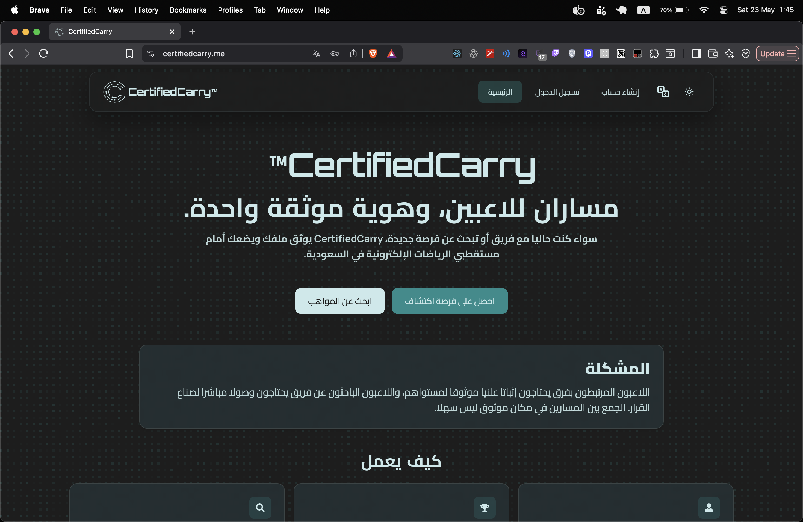
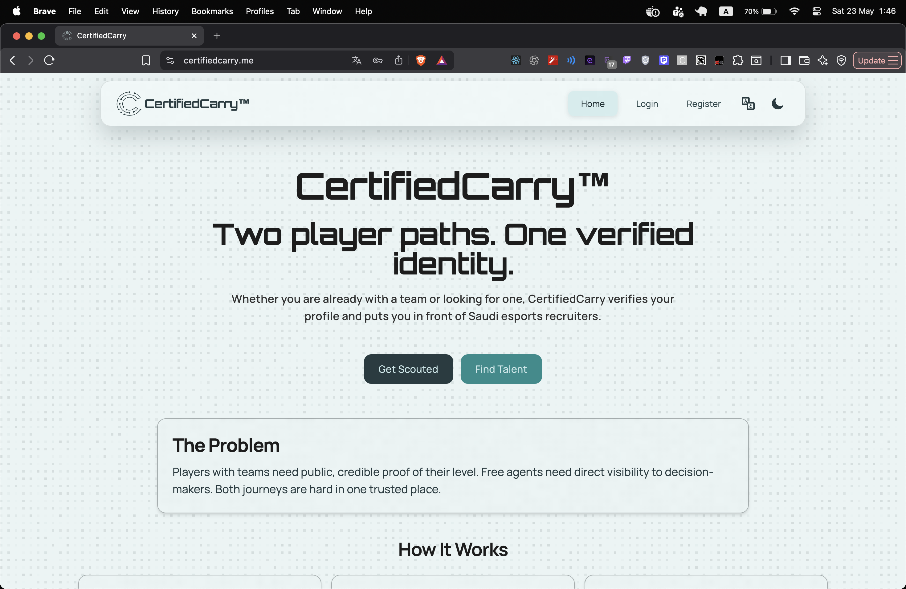
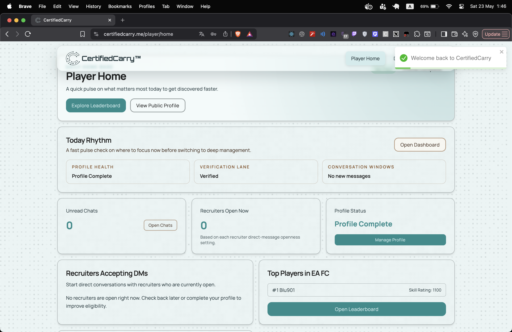
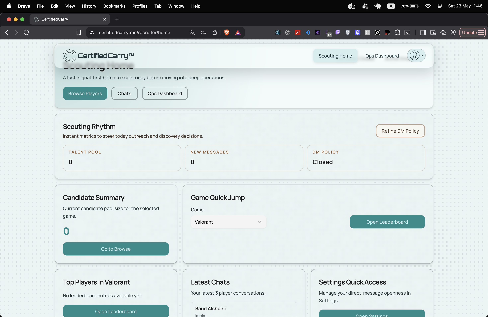
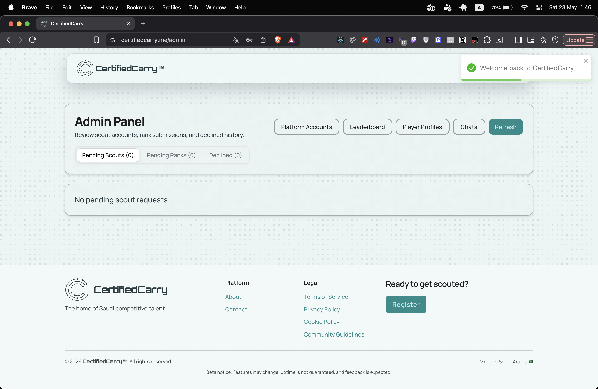

# CertifiedCarry

A full-stack esports talent discovery platform built with React, Spring Boot, PostgreSQL, and Firebase.

## Overview

CertifiedCarry helps competitive players get discovered, helps recruiters find verified talent, and gives admins the tools to moderate approvals and verification workflows.

This repository is split into two applications:

- `frontend/` — React + Vite client
- `backend/` — Spring Boot API

## Features

- Firebase-backed authentication
- role-aware access for `PLAYER`, `RECRUITER`, and `ADMIN`
- player profile creation and editing
- recruiter approval workflow
- rank verification workflow
- verified leaderboard
- authenticated chat
- admin moderation tools
- Arabic/English support
- dark/light theme support
- presigned media uploads
- backend audit logging and rate limiting

## Tech Stack

### Frontend

- React 19
- Vite
- React Router
- HeroUI
- Tailwind CSS + DaisyUI
- Axios
- Firebase Web SDK

### Backend

- Java 21
- Spring Boot 3.5
- Spring Security
- Spring Data JPA + Hibernate
- JdbcTemplate
- PostgreSQL
- Flyway
- Firebase Admin SDK

## Project Structure

```text
certifiedcarry/
  frontend/
  backend/
```

## Run Locally

### Frontend

```bash
cd frontend
npm install
npm run dev
```

Build:

```bash
npm run build
```

### Backend

```bash
cd backend
./mvnw spring-boot:run
```

Build and test:

```bash
./mvnw clean package
./mvnw test
```

## Run with Docker Compose

From the repository root run:

```bash
docker compose up --build
```

Then open:

- frontend: `http://localhost:3005`
- backend health endpoint: `http://localhost:8000/api/actuator/health`

This local Docker setup includes:

- PostgreSQL
- Spring Boot backend
- Vite frontend

This local Docker setup intentionally does not include:

- Firebase authentication
- DigitalOcean Spaces / object storage
- outbound email delivery

Local Docker notes:

- the backend starts with `FIREBASE_ENABLED=false`
- the backend starts with `OBJECT_STORAGE_ENABLED=false`
- the frontend can boot without Firebase keys, but Firebase-backed login and signup flows will not work until real Firebase configuration is added
- the frontend proxies `/api` requests to the backend container

To stop the stack:

```bash
docker compose down
```

To also remove the local Postgres volume:

```bash
docker compose down -v
```

## Environment

Use the included `.env.example` files as templates:

- `frontend/.env.example`
- `backend/.env.example`

## Architecture

The codebase is organized to keep responsibilities clear:

- frontend pages orchestrate screens
- frontend services handle API and client-side domain logic
- backend controllers handle HTTP concerns
- backend services handle business rules
- backend repositories and JDBC gateways handle persistence
- cross-cutting concerns like security, auditing, and rate limiting are centralized

## Design Patterns

- **Creational — Factory:** backend user creation uses role-specific factories
- **Structural — Facade:** frontend and backend service layers expose stable high-level APIs
- **Behavioral — Chain of Responsibility:** backend request filters handle authentication, audit logging, and throttling in sequence
- **Additional — Observer:** frontend auth events are emitted and consumed through an observer-based event flow

## Notes

- frontend expects the backend under `/api` unless overridden by environment variables
- backend defaults to port `8000`
- backend deployment is container-friendly through its included `Dockerfile`

## Summary

CertifiedCarry is a full-stack React and Spring Boot system with clear separation between UI orchestration, client service logic, HTTP controllers, backend business services, and persistence.

## Application Screenshots

### Landing Page - Arabic Dark Mode



### Landing Page - English Light Mode



### Player Home



### Recruiter Home



### Admin Panel



## Generative AI Disclosure

Generative AI tools were used as a limited development assistant, primarily to support backend implementation, debugging, testing, and code organization. The project idea, requirements, feature decisions, implementation review, and final submission responsibility remain my own.
